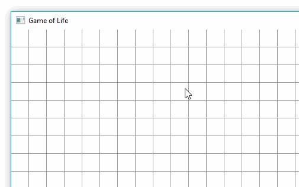

# Conway's Game of Life

This is my implementation of Conway's Game of Life written in C++ using the SFML library. This program is created for educational purpose, as I am learning to program in C++.

There are several decisions that I made regarding this implementation:

1. The grid is wrapped.
2. The initial state is random.
3. User can pause/play by pressing the `p` key.
4. User can toggle live/dead cell by clicking on the cell (only during pause).
5. User can change speed using left/right arrow keys.

Below is the preview:

